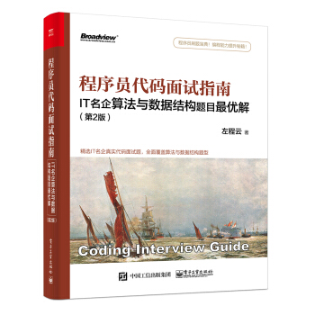

# 程序员代码面试指南：IT名企算法与数据结构题目最优解

**Wang Yufei, 2019-9.24** 

&emsp; &emsp;本项目用于复现**左程云老师**书籍《**程序员代码面试指南:IT名企算法与数据结构题目最优解**》(第二版)中算法代码。作者使用Java作为[书中代码](http://www.broadview.com.cn/book/4889)的实现方式，并采用面向对象方式进行封装(风格类似于LeetCode)。本人参照作者思路(可能会有些许变动)，使用C++进行编程复现。编写的代码均可在[牛客网评测系统](https://www.nowcoder.com/ta/programmer-code-interview-guide)中成功通过测试。:arrow_down: 

**做题流程**：

1. 看清题目、输入输出等；
2. 考察所有可能的情况，将过程完整的模拟一遍，讨论细节；
3. 编写代码、注意细节实现。

## 常用数据结构的实现

&emsp;&emsp;本块主要列举书中所涉数据结构的实现。其中部分数据结构尝试使用C++或python手编实现(可能并不整洁高效，为demo版)，也有数据结构可直接调用C++ STL(标准模板库)实现，具体用法可见官方文档。

| 对应书中章节 | 数据结构 |                         STL官方文档                          |                实现方式(demo版)                |
| :----------: | :------: | :----------------------------------------------------------: | :--------------------------------------------: |
|      1       |    栈    |   [stack](http://www.cplusplus.com/reference/stack/stack/)   |           [Python](ADT_py/Stack.py)            |
|      1       |   队列   |   [queue](http://www.cplusplus.com/reference/queue/queue/)   |           [Python](ADT_py/Queue.py)            |
|      1       | 双端队列 |   [deque](http://www.cplusplus.com/reference/deque/deque/)   |           [Python](ADT_py/Deque.py)            |
|      2       |   链表   |    [list](http://www.cplusplus.com/reference/list/list/)     |        [C++](ADT_cpp/LinkList_demo.cpp)        |
|      5       |  字符串  | [C++ String类](http://www.cplusplus.com/reference/string/string/) |                       无                       |
|      9       | 计算几何 |                              无                              | [C++](ADT_cpp/Coputational_Geometry.cpp)(未完) |

## 第一章：栈与队列

| 序号 |                             题目                             | 难度 |    完成时间    |                             实现                             |       标签       |
| :--: | :----------------------------------------------------------: | :--: | :------------: | :----------------------------------------------------------: | :--------------: |
|  1   | [设计getMin功能的栈](https://www.nowcoder.com/practice/05e57ce2cd8e4a1eae8c3b0a7e9886be?tpId=101&tqId=33073&rp=1&ru=/ta/programmer-code-interview-guide&qru=/ta/programmer-code-interview-guide/question-ranking) |  1   |   2019-9.24    | [C++](CH1_Stack_Queue/1_getMin.cpp)，[Python](CH1_Stack_Queue/1_getMin.py) |      栈设计      |
|  2   | [使用两个栈模拟队列](https://www.nowcoder.com/practice/6bc058b32ee54a5fa18c62f29bae9863?tpId=101&tqId=33074&tPage=1&rp=1&ru=/ta/programmer-code-interview-guide&qru=/ta/programmer-code-interview-guide/question-ranking) |  2   |   2019-9.24    |           [C++](CH1_Stack_Queue/2_stack_queue.cpp)           |      栈设计      |
|  3   | [用递归函数和栈逆序一个栈](https://www.nowcoder.com/practice/1de82c89cc0e43e9aa6ee8243f4dbefd?tpId=101&tqId=33075&rp=1&ru=/ta/programmer-code-interview-guide&qru=/ta/programmer-code-interview-guide/question-ranking) |  2   |   2019-9.26    |   [C++](CH1_Stack_Queue/3_Inverse_Stack_by_Recursion.cpp)    |       递归       |
|  4   | [猫狗队列](https://www.nowcoder.com/practice/8a7e04cff6a54b7095b94261d78108f5?tpId=101&tqId=33168&tPage=1&rp=1&ru=/ta/programmer-code-interview-guide&qru=/ta/programmer-code-interview-guide/question-ranking) |  1   |   2019-10.3    |          [C++](CH1_Stack_Queue/4_Dog_Cat_Queue.cpp)          |      大模拟      |
|  5   | [用一个栈实现另一个栈的排序](https://www.nowcoder.com/practice/ff8cba64e7894c5582deafa54cca8ff2?tpId=101&tqId=33081&tPage=1&rp=1&ru=/ta/programmer-code-interview-guide&qru=/ta/programmer-code-interview-guide/question-ranking) |  1   |   2019-9.28    |           [C++](CH1_Stack_Queue/5_Sort_Stack.cpp)            |      栈设计      |
|  6   | [用栈来求解汉诺塔问题](https://www.nowcoder.com/practice/1a2f618b3433487295657b3414f4e7c4?tpId=101&tqId=33090&tPage=1&rp=1&ru=/ta/programmer-code-interview-guide&qru=/ta/programmer-code-interview-guide/question-ranking) |  3   |   2019-10.8    |        [C++](CH1_Stack_Queue/6a_Hanoi_Recursive.cpp)         |       递归       |
|  7   | [生成窗口最大值数组](https://www.nowcoder.com/practice/b316c7f9617744b98fa311ae29ac516c?tpId=101&tqId=33083&tPage=1&rp=1&ru=/ta/programmer-code-interview-guide&qru=/ta/programmer-code-interview-guide/question-ranking) |  2   |   2019-10.6    |        [C++](CH1_Stack_Queue/7_Max_Windows_Array.cpp)        |     双端队列     |
|  8a  | [单调栈结构--基础](https://www.nowcoder.com/practice/e3d18ffab9c543da8704ede8da578b55?tpId=101&tqId=33169&tPage=1&rp=1&ru=/ta/programmer-code-interview-guide&qru=/ta/programmer-code-interview-guide/question-ranking) |  2   | **2019**-10.11 | [C++_v1_](CH1_Stack_Queue/8a1_Monotate_Stack.cpp) [C++_v2_](CH1_Stack_Queue/8a2_Monotate_Stack.cpp) | 模拟 单调栈 |
|  8b  | [单调栈结构--进阶](https://www.nowcoder.com/practice/2a2c00e7a88a498693568cef63a4b7bb?tpId=101&tqId=33256&tPage=1&rp=1&ru=/ta/programmer-code-interview-guide&qru=/ta/programmer-code-interview-guide/question-ranking) |  3   |   2019-10.13   |         [C++](CH1_Stack_Queue/8b_Monotate_Stack.cpp)         |     数据组织     |
|  9   | [最大子矩阵](https://www.nowcoder.com/practice/ed610b2fea854791b7827e3111431056?tpId=101&tqId=33084&tPage=1&rp=1&ru=/ta/programmer-code-interview-guide&qru=/ta/programmer-code-interview-guide/question-ranking) |  3   |   2019-10.15   |          [C++](CH1_Stack_Queue/9_Max_SubMatrix.cpp)          |    单调栈应用    |
|  10  | [最大值减最小值<=num的子数组数量](https://www.nowcoder.com/practice/5fe02eb175974e18b9a546812a17428e?tpId=101&tqId=33086&tPage=1&rp=1&ru=/ta/programmer-code-interview-guide&qru=/ta/programmer-code-interview-guide/question-ranking) |  3   |   2019-10.17   |          [C++](CH1_Stack_Queue/10_Max_Min_Num.cpp)           |   双端队列应用   |
| 11a  | [可见山峰对数--基础](https://www.nowcoder.com/practice/80d076bcea594b86ba55b913de4c069d?tpId=101&tqId=33170&tPage=1&rp=1&ru=/ta/programmer-code-interview-guide&qru=/ta/programmer-code-interview-guide/question-ranking) |  2   |   2019-10.17   |          [C++](CH1_Stack_Queue/11_Mountain_Num.cpp)          |     数学思维     |
| 11b  | [可见山峰对数--进阶](https://www.nowcoder.com/practice/16d1047e9fa54cea8b5170b156d89e38?tpId=101&tqId=33173&tPage=1&rp=1&ru=/ta/programmer-code-interview-guide&qru=/ta/programmer-code-interview-guide/question-ranking) |  4   |                |                                                              |    单调栈应用    |

> **注**：8b题(单调栈结构--进阶)本人C++代码**超时**：仅通过75%测试样例！未能找到原因。

## 第二章：链表

| 序号 |                             题目                             | 难度 |  完成时间  |                             实现                             |            标签             |
| :--: | :----------------------------------------------------------: | :--: | :--------: | :----------------------------------------------------------: | :-------------------------: |
|  1   | [打印两个有序链表的公共部分](https://www.nowcoder.com/practice/8943eea40dbb4185b187d80fd050fee9?tpId=101&tqId=33116&tPage=1&rp=1&ru=/ta/programmer-code-interview-guide&qru=/ta/programmer-code-interview-guide/question-ranking) |  1   | 2019-10.17 |           [C++](CH2_LinkedList/1_Overlap_List.cpp)           |          链表遍历           |
|  2   | [删除链表倒数第K个节点](https://www.nowcoder.com/practice/e5d90aac4c8b4628aa70d9b6597c0560?tpId=101&tqId=33117&tPage=1&rp=1&ru=/ta/programmer-code-interview-guide&qru=/ta/programmer-code-interview-guide/question-ranking) |  1   | 2019-10.19 |           [C++](CH2_LinkedList/2_Delete_Lastk.cpp)           |          链表遍历           |
|  3   |                       删除链表中间节点                       |  1   | 2019-10.19 |          [C++](CH2_LinkedList/3_Delete_Medium.cpp)           |          链表遍历           |
|  4   | [反转单向和双向链表](https://www.nowcoder.com/practice/b66a251dec8847f386bbe6cd96b7e9c8?tpId=101&tqId=33175&tPage=1&rp=1&ru=/ta/programmer-code-interview-guide&qru=/ta/programmer-code-interview-guide/question-ranking) |  1   | 2019-10.19 |        [C++](CH2_LinkedList/4_Reverse_LinkedList.cpp)        |          链表遍历           |
|  5   | [反转部分单链表](https://www.nowcoder.com/practice/f11155006f154419b0bef6de8918aea2?tpId=101&tqId=33176&tPage=1&rp=1&ru=/ta/programmer-code-interview-guide&qru=/ta/programmer-code-interview-guide/question-ranking) |  2   | 2019-10.21 |      [C++](CH2_LinkedList/5_Reverse_SubLinkedList.cpp)       |          链表遍历           |
|  6a  | [环形链表的约瑟夫问题--基础](https://www.nowcoder.com/practice/c3b34059faf546d3a7ee28f2b0154286?tpId=101&tqId=33177&tPage=1&rp=1&ru=%2Fta%2Fprogrammer-code-interview-guide&qru=%2Fta%2Fprogrammer-code-interview-guide%2Fquestion-ranking) |  1   | 2019-10.23 |             [C++](CH2_LinkedList/6a_Joseph.cpp)              |          循环链表           |
|  6b  | [环形链表的约瑟夫问题--进阶](https://www.nowcoder.com/practice/67741e15f1404e9fb26fd8192f02a870?tpId=101&tqId=33178&tPage=1&rp=1&ru=/ta/programmer-code-interview-guide&qru=/ta/programmer-code-interview-guide/question-ranking) |  3   | 2019-10.25 |             [C++](CH2_LinkedList/6b_Joseph.cpp)              |          数学思维           |
|  7a  | [判断链表是否是回文结构--基础](https://www.nowcoder.com/practice/4b13dff86de64f84ac284e31067b86e2?tpId=101&tqId=33179&tPage=1&rp=1&ru=%2Fta%2Fprogrammer-code-interview-guide&qru=%2Fta%2Fprogrammer-code-interview-guide%2Fquestion-ranking) |  1   | 2019-10.25 |           [C++](CH2_LinkedList/7a2_Palindrome.cpp)           |           栈设计            |
|  7b  | [判断链表是否是回文结构--进阶](https://www.nowcoder.com/practice/cdef686631204f079b8f36fe99602fca?tpId=101&tqId=33180&tPage=1&rp=1&ru=/ta/programmer-code-interview-guide&qru=/ta/programmer-code-interview-guide/question-ranking) |  2   | 2019-10.27 |           [C++](CH2_LinkedList/7b_Palindrome.cpp)            |      跳跃指针+链表重构      |
|  8   | [将单链表按某值划为左边小, 中间相等,右边大形式](https://www.nowcoder.com/practice/04fcabc5d76e428c8100dbd855761778?tpId=101&tqId=33181&tPage=1&rp=1&ru=/ta/programmer-code-interview-guide&qru=/ta/programmer-code-interview-guide/question-ranking) |  2   | 2019-10.27 |            [C++](CH2_LinkedList/8a_Partition.cpp)            |          Partition          |
|  9   | [复制含随机指针节点的链表 (LeetCode 138)](https://leetcode-cn.com/problems/copy-list-with-random-pointer/) |  2   | 2019-11.4  | [C++_v1_](CH2_LinkedList/9a_Random_LinkedList.cpp) [C++_v2_](CH2_LinkedList/9b_Random_LinkedList.cpp) | 链表遍历+哈希 链表遍历 |
|  10  | [两个单链表生成相加链表](https://www.nowcoder.com/practice/2d4ae9ef94c8412ebe49118f8e1da2df?tpId=101&tqId=33182&tPage=1&rp=1&ru=/ta/programmer-code-interview-guide&qru=/ta/programmer-code-interview-guide/question-ranking) |  1   | 2019-10.30 | [C++_v1_](CH2_LinkedList/10a_Add_2LinkedList.cpp) [C++_v2_](CH2_LinkedList/10b_Add_2LinkedList.cpp) |    栈设计 链表遍历     |
|  11  |                  两个单链表相交的一系列问题                  |      |            |                                                              |                             |
|  12  | [将单链表的每K个节点之间逆序](https://www.nowcoder.com/practice/66285653d28b4ed6a15613477670e936?tpId=101&tqId=33187&tPage=1&rp=1&ru=/ta/programmer-code-interview-guide&qru=/ta/programmer-code-interview-guide/question-ranking) |  2   | 2019-11.16 | [C++_v1_](CH2_LinkedList/12a_Reverse_KNode.cpp) [C++_v2_](CH2_LinkedList/12b_Reverse_KNode.cpp) |      栈设计、链表遍历       |
|  13  | [删除无序单链表中重复出现的节点](https://www.nowcoder.com/practice/fb3105d036344c6a8ecbef996e0b23a0?tpId=101&tqId=33205&tPage=1&rp=1&ru=/ta/programmer-code-interview-guide&qru=/ta/programmer-code-interview-guide/question-ranking) |  1   | 2019-11.16 | [C++_v1_](CH2_LinkedList/13a_Delete_Repeat_node.cpp) [C++_v2_](CH2_LinkedList/13b_Delete_Repeat_node.cpp) |    哈希表 选择排序     |
|  14  | [删除单链表中指定值节点](https://www.nowcoder.com/practice/1a5fd679e31f4145a10d46bb8fd3d211?tpId=101&tqId=33206&tPage=1&rp=1&ru=%2Fta%2Fprogrammer-code-interview-guide&qru=%2Fta%2Fprogrammer-code-interview-guide%2Fquestion-ranking) |  1   | 2019-11.16 |       [C++](CH2_LinkedList/14_Delete_Specify_node.cpp)       |          链表遍历           |
|  15  | [将二叉搜索树转换为双向链表](https://www.nowcoder.com/practice/2d3188a7e3ce4af2a9ebd5b89843fced?tpId=101&tqId=33224&tPage=1&rp=1&ru=/ta/programmer-code-interview-guide&qru=/ta/programmer-code-interview-guide/question-ranking) |  2   |            |                                                              |                             |

> **注意**：13题C++_v2_版因算法时间复杂度高而无法在OJ上通过测试。

**链表总结**：

- **删除链表某一节点**：需要记录该节点的前驱节点；(题目：2，6a，13)
- **反转链表片段**：需要记录其中每一节点的前驱和后继节点；(题目：4，5，7b)
- **快速找到链表中间节点**：记录当前节点以及对应的跳跃节点。当前节点移动一步，跳跃节点移动两步。当跳跃节点到达末尾时，当前节点就是链表的中间节点；(题目：3，7a，7b)

- **利用栈解决链表问题**：可以使用栈解决链表的部分问题，如逆序、对称性、递归问题等。(题目：7a，10a，12a)

